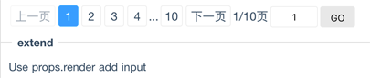

# paging.react

> React,Paging.Custom style!

[](https://travis-ci.org/fast-flow/paging.react)
[](https://npmjs.org/package/paging.react)
[](https://npmjs.org/package/paging.react)

[](https://saucelabs.com/u/paging_react)

## Install

```shell
npm install paging.react --save
```

## Example

[](http://fast-flow.github.io/paging.react/example)

## Online documentation

[Online](http://fast-flow.github.io/paging.react)

## Change log

[CHANGELOG](./CHANGELOG.md)


## Maintainers

<table>
  <tbody>
    <tr>
      <td align="center">
        <a href="https://github.com/nimojs"></a>
        <br>
        <a href="https://github.com/nimojs">Nimo Chu</a>
      </td>
    <tr>
  <tbody>
</table>

